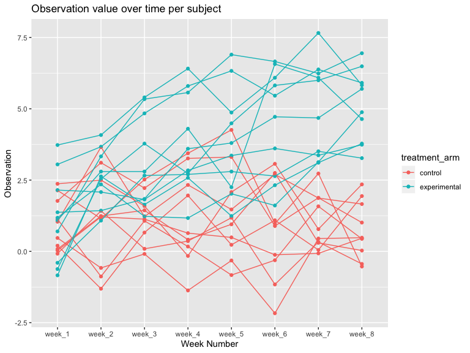

p8105\_hw5\_nja2140
================

Problem 1: Write a function that takes a vector as an argument; replaces
missing values using the rules defined above; and returns the resulting
vector. Apply this function to the columns of iris\_with\_missing using
a map statement.

``` r
iris_with_missing = iris %>% 
  map_df(~replace(.x, sample(1:150, 20), NA)) %>%
  mutate(Species = as.character(Species))
```

``` r
fn_one = function(x){
  if(is.numeric(x) == TRUE){
    x = x %>% replace_na(mean(x, na.rm = TRUE))
  }
  if(is.character(x) == TRUE){
    x = x %>% replace_na("virginica")
  }
  
  return(x)
}

iris_with_missing = map_df(iris_with_missing, fn_one)
```

Problem 2: Create a tidy dataframe containing data from all
participants, including the subject ID, arm, and observations over time:
-Start with a dataframe containing all file names; the list.files
function will help -Iterate over file names and read in data for each
subject using purrr::map and saving the result as a new variable in the
dataframe -Tidy the result; manipulate file names to include control arm
and subject ID, make sure weekly observations are “tidy”, and do any
other tidying that’s necessary

``` r
tidy_df = list.files(path="./data", full.names = TRUE) %>% 
  map(read.csv) %>% 
  rbind_all() %>% 
  mutate(
    subject_id = c(1:20),
    treatment_arm = ifelse(subject_id == c(1:10), "control", "experimental")
  ) %>% 
  select(subject_id, treatment_arm, everything())
```

Make a spaghetti plot showing observations on each subject over time,
and comment on differences between groups.

``` r
plot_one = 
  tidy_df %>% 
  pivot_longer(
    week_1:week_8,
    names_to = "week", 
    values_to = "observation"
  ) %>% 
  ggplot(aes(x = week, y = observation, color = subject_id)) +
         geom_point() + geom_line()
plot_one
```


